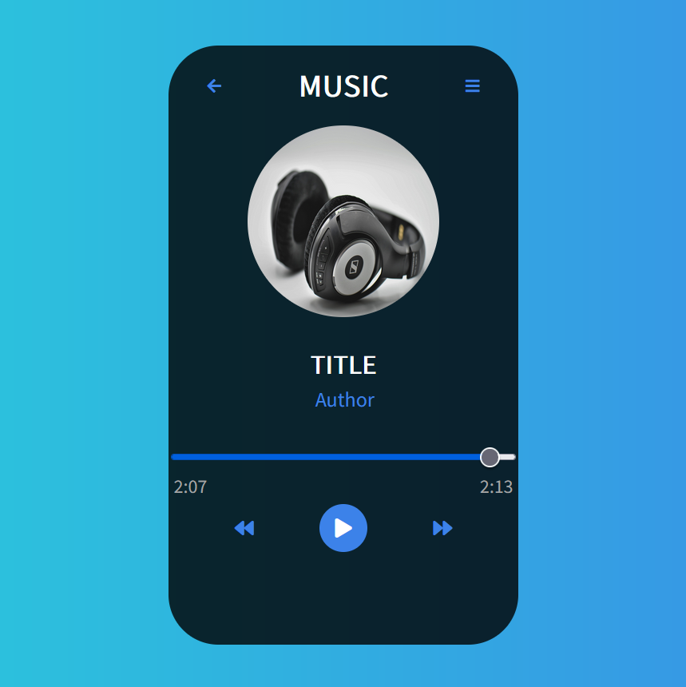

  

# :headphones: Song Player

## Introduction
This is a song player made with HTML5/CSS3 and JavaScript using the track An Epic Story by MaxKoMusic | https://maxkomusic.com/
Music promoted by https://www.chosic.com/free-music/all/
Creative Commons Attribution-ShareAlike 3.0 Unported (CC BY-SA 3.0)
https://creativecommons.org/licenses/by-sa/3.0/.

## General information
This application is a song player permitting user listening song,  
**stop** it or **go back** and **go forward** on song duration

## Technologies

  
  
  

## Installation
1. Download the project on your system
2. Run `index.html`

## Features
*Note: `THING` below stands for a button*
 
- `PLAY/PAUSE` : Toggle between paused and playing states
- `BACKWARD` : Go back on the last 10 seconds of the track
- `FORWARD` : Go forward on the 10 seconds later of the track  

You can use the **slider controller** to select a particular moment of the song

## To Do
- Night/Day mode
- Animation when music is playing